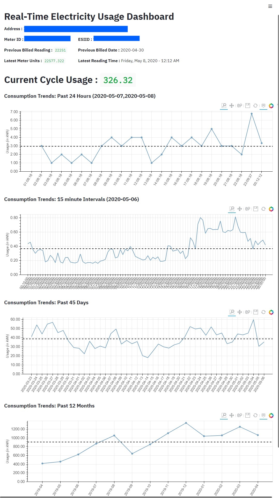

# Electricity Usage Trends 
A Utility to Create a Real Time Dashboard showing your power/energy consumption trends.  This utility currently supports the energy consumers of Texas, USA.
  
Read more about the Project on [**medium.com**](https://medium.com/@ankitkchoudhary/electricity-usage-dashboard-using-python-raspberry-pi-available-on-github-7b0b31f866d1) .  
**Author** : Ankit Choudhary  
**E-Mail**: ankitkchoudhary@gmail.com 

## Continuous Integration Enabled:
This repo has CI/CD enabled with **Docker Hub**. The code base has been split up into 2 parts: 
1. Data handler: (Handling the Backend Orchestration of Data Manufacturing)
2. Dashboard: (Handling the Rendering of Dashboard)

The respective Images can be found here:
[ankitkchoudhary/electricity-usage-monitoring-data-handler](https://hub.docker.com/repository/docker/ankitkchoudhary/electricity-usage-monitoring-data-handler)  
[ankitkchoudhary/electricity-usage-monitoring-dashboard](https://hub.docker.com/r/ankitkchoudhary/electricity-usage-monitoring-dashboard)  

The application has been split up in 2 segments to enable elasticity in the deployment options.   
**Example:** You might want to Run the Data Handler on a Public Cloud, whereas the Dashboard App on a Single board Computer at your residence.

## Dashboard - Preview

## Pre-Requisites
You must create an account with the Texas Smart Meter Services by providing your meter number and address details.
https://www.smartmetertexas.com/

The user name and password are the main controller for this application.

## Setting Smart Meter Credentials:-
### Option 1: Set via Environment Variables 
Username : Set it as a Environment Variable: <code>SMART_METER_USERNAME</code> 
Password : Set it as a Environment Variable: <code>SMART_METER_PASSWORD</code>

### Option 2: Set via Files (secrets.ini) 
Edit the Secrets.ini file included in the repo and substitute the values at the concerned places. 
[CREDENTIALS] SMART_METER_USERNAME = \<UserName>  
SMART_METER_PASSWORD = \<Password>
  
### This application also supports Microsoft Azure Cloud 
_(Running via Docker Containers, Storing Data Files to Azure BLOB, etc.)_
## Setting Azure BLOB Credentials:-
### Option 1: Set via Environment Variables 
Account Name : Set it as a Environment Variable: <code>BLOB_ACCOUNT_NAME</code> 
Account Key : Set it as a Environment Variable: <code>BLOB_ACCOUNT_KEY</code>  
Container Name : Set it as a Environment Variable: <code>BLOB_CONTAINER_NAME</code>

### Option 2: Set via Files (secrets.ini) 
Edit the Secrets.ini file included in the repo and substitute the values at the concerned places. 
[AZURE_BLOB] 
BLOB_ACCOUNT_NAME = \<Account Name>  
BLOB_ACCOUNT_KEY = \<Account Key>  
BLOB_CONTAINER_NAME = \<Container Name>  

## Dashboard Preview
Placeholder for Dashboard Screenshot

## Smart Meter API Limits:
The limits discovered so far:- 
1. Max 2 in 60 Minutes. 
2. Max 24 in 1 Day. 
> That leaves us to setup as **1/Hour** if we were to run this app seamlessly.

## Data Files:
_The Data Files Shown in this Repository are for Demonstration Purposes only. Please make sure that you delete them from your local copy._ 

#### current_usage.csv 
> Stores the Units used in the ongoing billing cycle.
#### daily_trends.csv
> Stores the Units used during the past 45 days on a daily basis.
#### historic_hourly_trend.csv
> Stores the Historical Meter Reading Since the Onboarding of this App. This is currentl not being used in any analysis/rendering. However, since it's a crucial data, we plan to retain it for future use cases.

#### interval_trends.csv
> Stores the Units used on the day-before-yesterday (T-2) on a 15 minutes interval window.

#### last_billed_meter_reading.csv
> Stores the Details of the Meter Reading and Date for the Last Billing Cycle.

#### latest_meter_reading.csv
> Stores the Details of the Meter Reading and Time for the Latest Meter Reading.`

#### meter_info.csv
> Stores the Details of the Meter (Address, IDS, etc.)

#### monthly_trends.csv
> Stores the Units used during the past 12 months on a monthly basis.

#### past_24_hour_trend.csv
> Stores the Units used during the past 24 hours based on the available data points.

#### usage_since_last_reading.csv
> Units Consumed Since the Last Time a Meter Reading was Performed. (Not used in the Dashboard)

  
## Starting the Data Handler App
### Option 1: Using PY Files:-
Step 1: Clone this Git Repo. 
Step 2: Navigate to the Folder Containing  the Files. 
Step 3: Set the Credentials as shown above in the secrets.ini file.
Step 4: Make Sure that the PY requirements are satisfied. Run the below:
> <code>pip install -r ./requirements.txt</code>  

Step 5: Setup a Scheduler (crontab - Linux, task scheduler - Win) to run the file "runner.py" every hour (desired frequency).
 
### Option 2: Using Docker Image Files:-
Step 1: Clone the below Images from Docker Hub:- 
> [ankitkchoudhary/electricity-usage-monitoring-data-handler](https://hub.docker.com/repository/docker/ankitkchoudhary/electricity-usage-monitoring-data-handler)  
> [ankitkchoudhary/electricity-usage-monitoring-dashboard](https://hub.docker.com/r/ankitkchoudhary/electricity-usage-monitoring-dashboard)  

Step 2: Create an Environment File as shown in the example file (docker_env.env) 
Step 3: Set the Credentials as shown above in the docker env file. 
Step 4: Run Docker image. 
> Run the Below: 
> <code> docker run -it --env-file ./docker_env.env ankitkchoudhary/electricity-usage-monitoring-data-handler:latest </code>

## Starting the Dashboard App
### Option 1: Using PY Files:-
Step 1: Clone this Git Repo. 
Step 2: Navigate to the Folder Containing  the Files. 
Step 3: Set the Credentials as shown above in the secrets.ini file. 
Step 4: Make Sure that the PY requirements are setup. 
> Run the below: 
> <code>pip install -r ./requirements.txt</code>

Step 5: Open the Terminal (CMD Line - Win), Navigate to the Application Folder. Trigger the run as :-
> <code>streamlit run render_dashboard.py </code> 
 
### Option 2: Using Docker Image Files:-
Step 1: Clone the below Images from Docker Hub:- 
> [ankitkchoudhary/electricity-usage-monitoring-data-handler](https://hub.docker.com/repository/docker/ankitkchoudhary/electricity-usage-monitoring-data-handler)  
> [ankitkchoudhary/electricity-usage-monitoring-dashboard](https://hub.docker.com/r/ankitkchoudhary/electricity-usage-monitoring-dashboard)  

Step 2: Create an Environment File as shown in the example file (docker_env.env) 
Step 3: Set the Credentials as shown above in the docker env file. 
Step 4: Run the Docker image as: 
> <code> docker run -it --env-file ./docker_env.env ankitkchoudhary/electricity-usage-monitoring-dashboard:latest </code>

### The Dashboard will be available to you on the Local Host, Port 8501:
> <code> http://localhost:8501/ </code>
